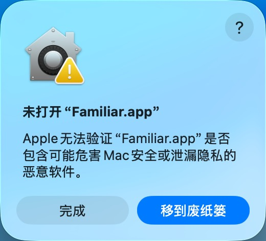
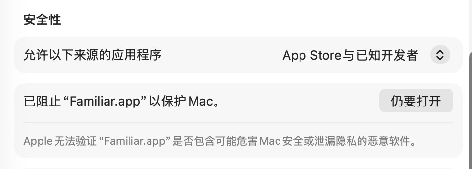
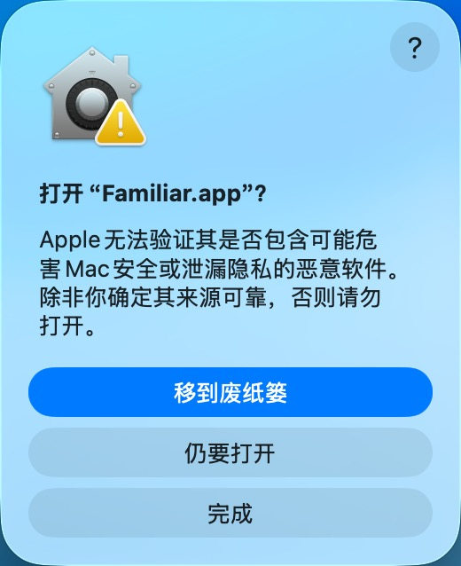

# Familiar

> *一只会回应你工作世界的桌面宠物。*

[English](README.md)

Familiar 是一个本地优先的编程 Agent 桌面伴侣。它把 Hook 事件转化为像素桌宠的动作、任务气泡和状态变化，让你无需盯着另一个面板也能感知 Agent 的工作进度。

## 特性

- **会回应的桌面宠物** —— 像素风动作随 Agent 活动变化，不打断工作流。
- **Agent 集成** —— 通过 Hook API 连接 Claude Code、Codex CLI、DeepSeek Harness、Qoder 和 Google Antigravity。
- **支持远程连接** —— Agent 与 Familiar 服务端可在远程机器运行，本地桌面端订阅桌宠状态。
- **系统状态仪表** —— 在桌宠旁显示 CPU、内存和磁盘占用。
- **Sprite Pack 皮肤包** —— 使用 `.fpack` 格式导入更多桌宠形象。
- **轻量低占用** —— UI 隐藏时暂停不必要的轮询。
- **隐私优先** —— 默认在本机处理事件，无遥测，运行日志最小化。

## 支持的集成

| 集成 | 传输方式 | 状态 |
| --- | --- | --- |
| Claude Code | Hooks | 可用 |
| Codex CLI | Hooks | 可用 |
| DeepSeek Harness | Hooks | 可用 |
| Qoder | Hooks | 可用 |
| Google Antigravity | Hooks | 可用 |

Familiar 只管理自己注入的 Hook。安装前会创建备份，并保留 Agent 的现有配置。

## 安装

### Homebrew

在 macOS 上安装桌面应用：

```bash
brew install --cask Monster12138/familiar/familiar
```

在 macOS 或 Linux 上安装 CLI：

```bash
brew install Monster12138/familiar/familiar-cli
```

### 下载发布包

从 [GitHub Releases](https://github.com/Monster12138/familiar/releases) 下载最新版本。

当前发布目标：

- macOS arm64 与 x86_64
- Windows x86_64
- Linux x86_64（`.deb` 与 AppImage）

macOS 安装包尚未使用 Apple Developer ID 签名和公证，Windows 安装包尚未进行代码签名。首次启动时，Gatekeeper 或 SmartScreen 可能要求手动允许。

### macOS 首次启动

由于 Familiar 尚未完成 Apple 公证，macOS 会在首次启动时阻止应用打开。如果你是通过本仓库的 Homebrew Tap 或 GitHub Releases 安装 Familiar，请按以下步骤手动允许：

1. 打开 Familiar。macOS 提示无法验证应用时，点击**完成**。

   

2. 打开**系统设置 → 隐私与安全性**，向下滚动到**安全性**区域，找到 Familiar 已被阻止的提示，然后点击**仍要打开**。

   

3. 在确认对话框中再次点击**仍要打开**。如果 macOS 要求认证，请输入密码或使用 Touch ID。此后 Familiar 即可正常打开。

   

仅当 Familiar 来自上方链接的官方来源时，才应绕过此安全警告。

## 从源码构建

需要 Rust 1.88+、Node.js 18+、npm，以及对应平台的桌面开发依赖。

```bash
cargo test --workspace
cargo clippy --workspace --all-targets -- -D warnings

cd app
npm ci
npm run build
npm run tauri dev
```

## 远程模式

默认仍为本地模式。远程模式下，Agent 与 `familiar-cli serve` 运行在同一台远程机器，本地桌面应用通过 WebSocket 订阅渲染状态。

远程模式不是 Hook Relay：桌面端不能转发本机 Agent 事件，也不能修改服务器上的 Hook。TLS、认证和部署方式见[远程模式部署指南](docs/REMOTE_DEPLOYMENT.md)。

## 隐私

为了渲染当前状态，Familiar 可能读取最近的任务说明、命令文本、工具名称、文件路径和被明确引用的 Antigravity transcript。它不会持久化完整 transcript 或 Agent 事件历史；运行日志不记录原始提示词、命令、路径或 Hook payload。

远程模式只在已配置的 Familiar 服务端与客户端之间传输经过长度限制的渲染状态摘要，不提供完整提示词、transcript、文件内容、Hook payload 或命令输出的远程查询接口。

详细说明见[隐私与数据处理](docs/PRIVACY.md)。

## 文档

- [隐私与数据处理](docs/PRIVACY.md)
- [远程模式部署指南](docs/REMOTE_DEPLOYMENT.md)
- [设计说明](docs/DESIGN.md)
- [Sprite Pack 制作指南](docs/SPRITE_PACK_CREATION_GUIDE.md)
- [开发与贡献指南](CONTRIBUTING.md)
- [发布流程](docs/RELEASE_PROCESS.md)

## 参与贡献

欢迎提交 Issue 和 Pull Request。开始之前请阅读 [CONTRIBUTING.md](CONTRIBUTING.md)、[CODE_OF_CONDUCT.md](CODE_OF_CONDUCT.md) 和 [SECURITY.md](SECURITY.md)。

请保持 Familiar 的隐私优先设计：未经明确的产品决策，不要添加遥测，也不要持久化用户提示词、transcript、文件内容或 Hook payload。

## 开源协议

Familiar 采用 [MIT](LICENSE-MIT) 或 [Apache-2.0](LICENSE-APACHE) 双重许可。内置 sprite、Sprite Pack 压缩包和应用图标使用相同许可证，详见 [ASSETS.md](ASSETS.md)。
